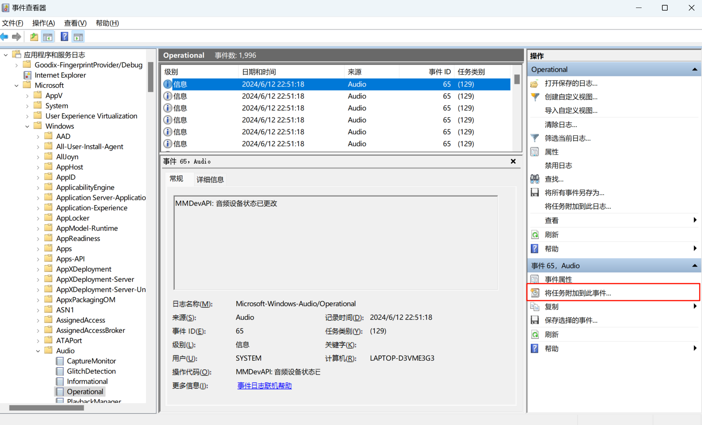
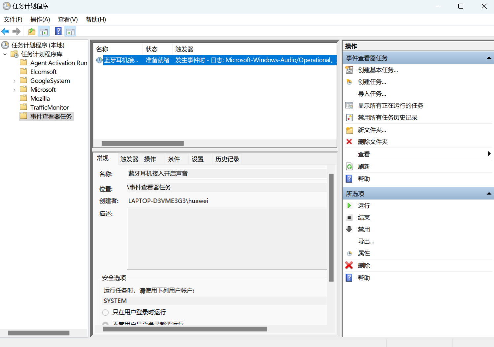
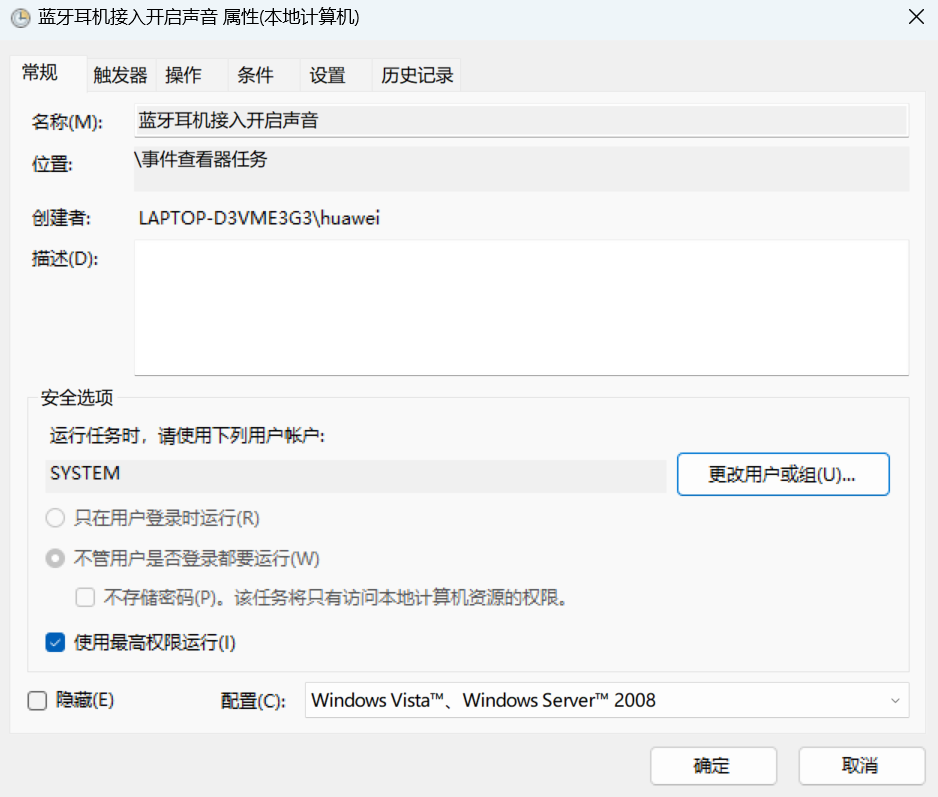
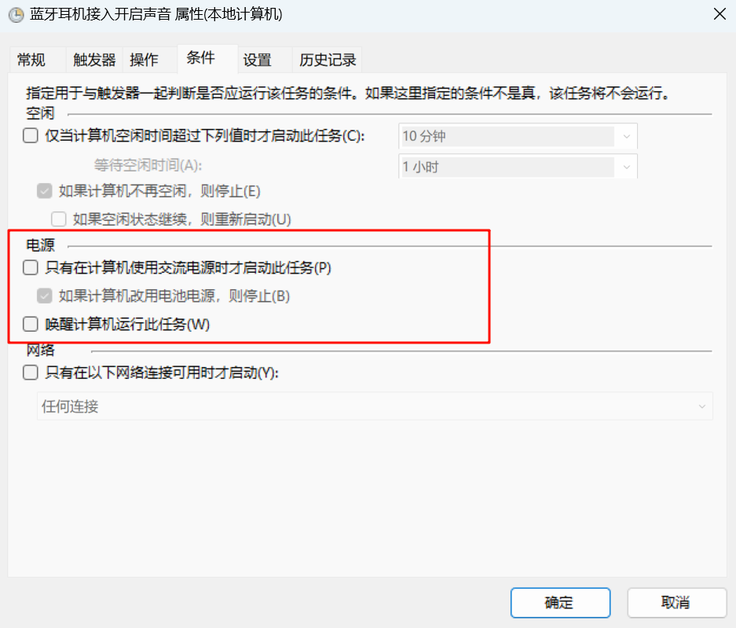

## 前言

不知道大家有没有遇到过这样的尴尬，在公共场合打开笔记本，以为连上耳机其实没连上偷偷摸鱼被发现，又或者耳机断开后电脑音频大声播放，又又或者投屏到大屏时后台的音频开始播放发出声音，如此如此这般这般等等这类的场景，  
如果你也遇到过，并对此苦恼，欢迎继续往后看解决方法，  
没遇到也没关系，最近几天我不知道触了什么霉头，全都赶上了，现在你可以笑一笑，然后滚出这个页面了


## 任务计划

解决方法的思路是：在蓝牙设备连接时允许播放音频，在断开/没有连接时自动设置为静音。这个自动化的过程交给 Windows 上的**任务计划执行**。

按 `Win` 搜索「事件查看器」面板，我们要找到蓝牙连接与断开的事件作为触发器（trigger），我搜索一圈没有找到这个事件，不过在[一个帖子](https://forum.vb-audio.com/viewtopic.php?t=590)的截图上发现了直接相关的事件：Windows 的音频操作事件，路径是 `事件查看器 => 应用程序和服务日志 => Microsoft => Windows => Audio => Operational`。

这个事件在音频设备变化时就会触发，也就是无论连接还是断开，触发的是同一个事件，与预期的不一样但是没关系，之后判断一下当前使用的设备就行了。先把任务计划加上，选择右边面板的「将任务附加到此事件」，这个可以帮我们根据事件自动填写任务计划的触发信息。在操作选择运行程序，之后的判断逻辑和静音操作使用 Powershell 写个脚本实现，  
所以这里程序填 `powershell.exe`，  
参数填 `-NoProfile -ExecutionPolicy Bypass -File "path\to\file"`，文件路径改成你自己的，  
之后在那里建一个 ps1 后缀的脚本文件



## 根据音频设备设置音量

首先是获取当前的音频设备，可以安装一个模块 `AudioDeviceCmdlets` 实现

多个设备名字用 `|` 分隔，这个 TWS-F9 是我耳机的名字，记得替换

```bash
# 安装模块
Install-Module -Name AudioDeviceCmdlets -Force
```

```powershell
# 导入模块
Import-Module AudioDeviceCmdlets
# 获取当前音频设备名
$currentDevice = Get-AudioDevice -Playback
$deviceName = $currentDevice.Name
if ($deviceName -match "Bluetooth|TWS-F9"){
    ...
}
```

然后调整音量 Powershell 自带的命令好像不好时，我找了一个命令行工具 NirCmd。下载：[nircmd-x64.zip](https://www.nirsoft.net/utils/nircmd-x64.zip)，之后扔到环境变量里

使用的命令只有两种，设置音量大小和设置静音，大概这样

```powershell

if ($deviceName -match "Bluetooth|TWS-F9"){
    & "nircmd.exe" setsysvolume 0 # max-value 65535
}else{
    & "nircmd.exe" mutesysvolume 1
}
```

<details>
  <summary>我的完整代码</summary>

```powershell
& "nircmd.exe" setsysvolume 0
& "nircmd.exe" mutesysvolume 1

# Install-Module -Name AudioDeviceCmdlets -Force
# Import the module    
Import-Module AudioDeviceCmdlets

# 获取当前默认的播放设备
$currentDevice = Get-AudioDevice -Playback
$deviceName = $currentDevice.Name

# 判断设备类型并设置音量
if ($deviceName -match "Bluetooth|TWS-F9") {
    $deviceType = "蓝牙设备"
    & "nircmd.exe" setsysvolume 6553 # max 65535
} elseif ($deviceName -match "Speakers|扬声器") {
    $deviceType = "系统自带扬声器"
    & "nircmd.exe" mutesysvolume 1
} else {
    $deviceType = "其他设备"
    & "nircmd.exe" mutesysvolume 1
}

# 输出当前使用的设备名称和类型
Write-Output "当前使用的设备名称: $deviceName"
Write-Output "当前使用的设备类型: $deviceType"
```

</details>


## 进一步优化

走到这一步其实已经完成了 90%，可以试试断开耳机连上耳机效果，或者，直接打开「任务计划程序」运行它



### 隐藏框口

如果你试过就会发现第一点问题、任务执行时会出现 Powershell 执行的窗口，但是又因为执行太快，窗口一闪而过，视觉效果不太优雅

把执行的用户换成 SYSTEM 可以解决这个问题，这个 SYSTEM 是 Windows 中至高无上的身份，掌握最重要的系统任务的权限，正常用户无法登录，似乎连用户界面都没有。在任务计划程序中找到刚才新建的任务，设置属性 `常规=>安全选项=>更改用户或组=>输入SYSTEM，点击检查名称` 成功。



但是现在直接运行的话会失败，为什么呢，经常自己打印日志的朋友就会发现，原来是报错说程序找不到 `Get-AudioDevice`

那给它装一个呗，用工具包 pstools 登录 SYSTEM [点我下载](https://download.sysinternals.com/files/PSTools.zip)，重新安装模块，问题解决，运行任务也没有窗口

```bash
psexec -i -s powershell.exe
Install-Module -Name AudioDeviceCmdlets -Force
```

### 电源条件设置

另一个问题是重中之重，点开刚才新建任务的属性设置，选择条件中有一个「电源」，请一定关闭

> 同学，你也不想因为没插电源再遇到那种情景吧（





## 延伸

写的时候找资料看到一篇根据 Wi-Fi 判断静音条件的类似文章: [Windows 连接特定 WiFi 自动静音](https://sspai.com/post/84576)

> 笔记本周末带回家，周一拿到办公室，打开 PotPlayer 刚想摸摸鱼，小电影的声音就自动播放出来😂，利用 Windows 计划任务和 NirCmd 命令行小程序帮你连接办公室 WiFi 时自动静音

原理差不多，这里记一下触发器设置：选择自定义

- 事件日志：应用程序和服务日志 - Microsoft - Windows - WLAN - AutoConfig/Operational；
- 事件来源： WLAN - AutoConfig；
- 事件ID：8001；
- 任务类别：AcmConnection；

xml 里添加具体的 Wi-Fi 名

```xml
<QueryList>
 <Query Id="0" Path="Microsoft-Windows-WLAN-AutoConfig/Operational">
   <Select Path="Microsoft-Windows-WLAN-AutoConfig/Operational">*[System[Provider[@Name='Microsoft-Windows-WLAN-AutoConfig'] and Task = 24010 and (EventID=8001)]]and *[EventData[Data[@Name='SSID']='你的WiFi ssid']] </Select>
 </Query>
</QueryList>
```

## 参考资料

- [How to use PowerShell to modify sound volume? Solved - Windows 10 Forums](https://www.tenforums.com/sound-audio/167181-how-use-powershell-modify-sound-volume.html)
- [How to use Windows (10) task planer to use Bluetooth Headsets with VoicemeeterB - VB-Audio's Forums](https://forum.vb-audio.com/viewtopic.php?t=590)