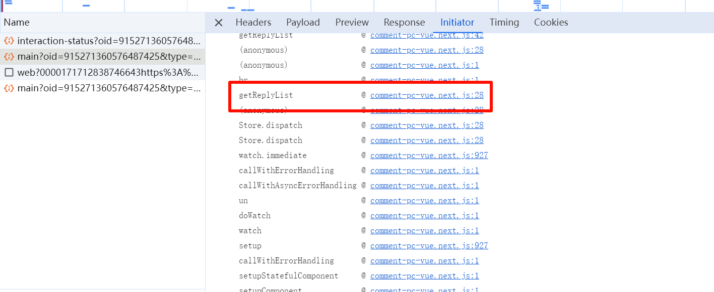
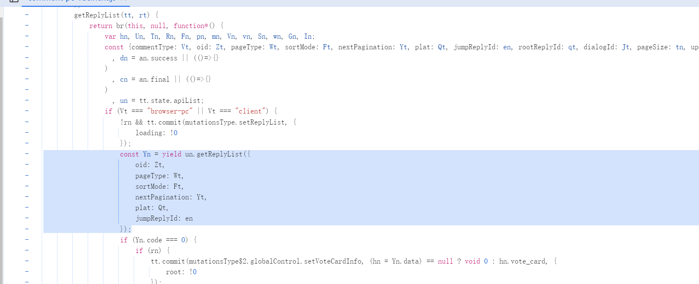
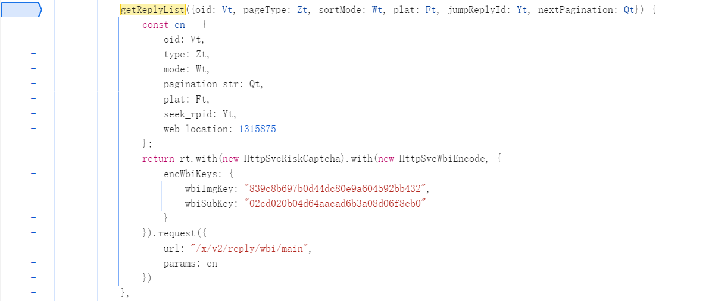
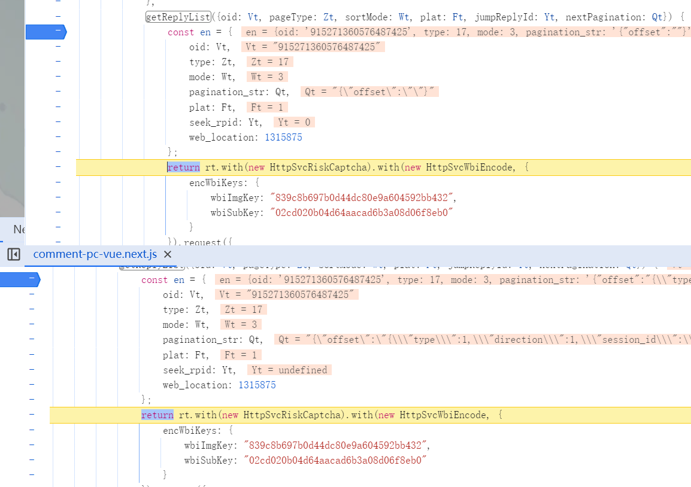
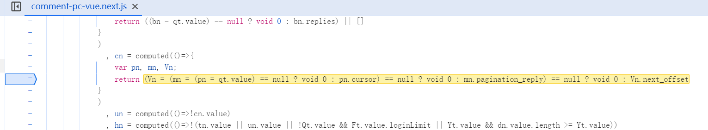
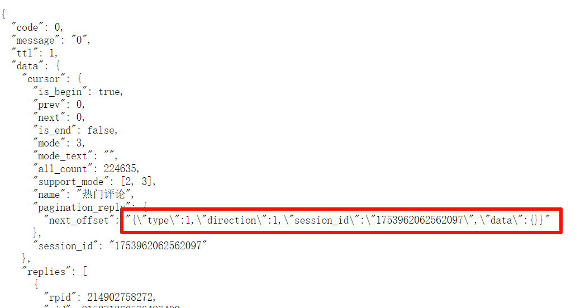

## 前言

前几天的碧蓝档案吧因为游戏和雀魂联动，麻辣人集体破防，到B站官号下面团建，截止 4/10 有了至少 220k 条评论。有群友说想把评论爬下来做数据分析，我也试了一下，顺便做个记录。


## 分析

### 初见

打开开发者工具，接口很好找：  

```python
https://api.bilibili.com/x/v2/reply/wbi/main?oid=915271360576487425&type=17&mode=3&pagination_str=%7B%22offset%22:%22%22%7D&plat=1&seek_rpid=0&web_location=1315875&w_rid=f3e31489b0f4d5dfe6c538261136d1a9&wts=1712838746
```

先是试了改字段里最像分页的 `pagination_str` ，但是。。。  

```
{"code":-403,"message":"访问权限不足","ttl":1}
```

其他的字段 `wts` 像时间戳，`web_location` 和 `w_rid` 不知道什么意思。然后多翻了几页，

```python
https://api.bilibili.com/x/v2/reply/wbi/main?oid=915271360576487425&type=17&mode=3&pagination_str=%7B%22offset%22:%22%7B%5C%22type%5C%22:1,%5C%22direction%5C%22:1,%5C%22session_id%5C%22:%5C%221753946872420510%5C%22,%5C%22data%5C%22:%7B%7D%7D%22%7D&plat=1&web_location=1315875&w_rid=381681a3d5b8cd76f54aab36b4476fe0&wts=1712839178
```

`web_location` 一直没有变化，最有可能的是 `w_rid`，感觉是某种加密，简单搜索了一下就看到 [bilibili-API-collect: WBI 签名](https://github.com/SocialSisterYi/bilibili-API-collect/blob/master/docs/misc/sign/wbi.md) (伟大 无需多盐)，具体说明见链接，以下是 python 实现

```python
from functools import reduce
from hashlib import md5
import urllib.parse
import time
import requests

mixinKeyEncTab = [
    46, 47, 18, 2, 53, 8, 23, 32, 15, 50, 10, 31, 58, 3, 45, 35, 27, 43, 5, 49,
    33, 9, 42, 19, 29, 28, 14, 39, 12, 38, 41, 13, 37, 48, 7, 16, 24, 55, 40,
    61, 26, 17, 0, 1, 60, 51, 30, 4, 22, 25, 54, 21, 56, 59, 6, 63, 57, 62, 11,
    36, 20, 34, 44, 52
]

def getMixinKey(orig: str):
    '对 imgKey 和 subKey 进行字符顺序打乱编码'
    return reduce(lambda s, i: s + orig[i], mixinKeyEncTab, '')[:32]

def encWbi(params: dict, img_key: str, sub_key: str):
    '为请求参数进行 wbi 签名'
    mixin_key = getMixinKey(img_key + sub_key)
    curr_time = round(time.time())
    params['wts'] = curr_time                                   # 添加 wts 字段
    params = dict(sorted(params.items()))                       # 按照 key 重排参数
    # 过滤 value 中的 "!'()*" 字符
    params = {
        k : ''.join(filter(lambda chr: chr not in "!'()*", str(v)))
        for k, v 
        in params.items()
    }
    query = urllib.parse.urlencode(params)                      # 序列化参数
    wbi_sign = md5((query + mixin_key).encode()).hexdigest()    # 计算 w_rid
    params['w_rid'] = wbi_sign
    return params

signed_params = encWbi(
    params={
        'foo': '114',
        'bar': '514',
        'baz': 1919810
    },
    img_key=img_key, # TODO
    sub_key=sub_key  # TODO
)
query = urllib.parse.urlencode(signed_params)
print(query)
```

加密算法现在知道了，加密需要 `img_key` 和 `sub_key`，仓库里说有的接口是请求得到，有的是写死的。不过遗憾的是这个仓库里关于动态评论区的 API 只是标记了 Wbi 签名，暂时还没有更新具体字段。看来只能自己逆向了


### 逆向开始

小手一翻，找到一个命令很有嫌疑的函数



进去看看，还套了一层，Ctrl+F 搜一下




σ ﾟ∀ ﾟ)σ 見つけた，密钥估计就是这两个了，然后是具体的查询字段

```
wbiImgKey: "839c8b697b0d44dc80e9a604592bb432",
wbiSubKey: "02cd020b04d64aacad6b3a08d06f8eb0"
```

```json
{
    oid: Vt,            // 目标评论区 id
    type: Zt,           // 评论区类型代码，17表示动态
    mode: Wt,           // 排序方式，默认为 3，0 3：仅按热度，1：按热度+按时间，2：仅按时间
    pagination_str: Qt, // 分页，第一页是 {"offset":""}，具体不明
    plat: Ft,           // 平台代码，网页端是 1
    seek_rpid: Yt,      // jumpReplyId
    web_location: 1315875
}
```

还需要找的是 `seek_rpid`（`jumpReplyId`）和 `pagination_str`（`nextPagination`） 的具体内容，总是先打个断点看看

### seek_rpid

翻了几页看了 `seek_rpid` 的内容，都是 0 或 undefined 这类值，（虽然后来我也没有找到具体含义）所以我大胆猜测这个值直接填 0！




### pagination_str

这个字段的形式如下：

```javascript
nextPagination: JSON.stringify({ // 第一次
    offset: ""
})

nextPagination: JSON.stringify({ // 之后的每一次
    offset: {
        "type": 1,
        "direction": 1,
        "session_id": "1753726982348946",
        "data": {}
    }
})
```

然后又过了很久很久。。。我到处打断点，找到一个 `cn`，他的值就是 `nextPagination`，胜利之道就在其中



关键在第二行的代码：

```javascript
return (Vn = (mn = (pn = qt.value) == null ? void 0 : pn.cursor) == null ? void 0 : mn.pagination_reply) == null ? void 0 : Vn.next_offset
```

分析之后得到最后返回值来自：`qt.value.cursor.pagination_reply.next_offset`

那么 `qt` 又是什么呢？又是一顿断点调试，找到一个 `qt = computed(()=>rt.state.apiData.replyList.res.data)`

*哈哈，觉得眼熟？😃*  
*这样的场景，此时此刻正在世界各地上演✋😮🖐️*

不错，这个 `res.data` 和 `cursor.pagination_reply.next_offset` 长的和接口返回的 json 中的字段一样，回去看一下



这不就有了嘛，现在可以填写最后的字段了

```python
signed_params = encWbi(
    params={
        "oid": 915271360576487425, 
        "type": 17, 
        "mode": 2, 
        "pagination_str": "{\"offset\":\"\"}", # 每次迭代替换 pagination
        "plat": 1, 
        "seek_rpid": 0, 
        "web_location": 1315875
    },
    img_key="839c8b697b0d44dc80e9a604592bb432",
    sub_key="02cd020b04d64aacad6b3a08d06f8eb0"
)
base_url = "https://api.bilibili.com/x/v2/reply/wbi/main?"
query = urllib.parse.urlencode(signed_params)
print(base_url + query)
```

## 爬取

理论存在，实践开始

写个爬虫爬取 `base_url + query`，每次得到响应之后用结果的 `next_offset` 替换 `pagination_str` 就可以继续爬下一页了。

编写过程中的注意点：

1. 游客身份无法获得除第一页以外的内容，所以需要在 header 传入 Cookie
2. 经过亲身实践，这个接口没有限制访问频率（不然 220k 条评论我真的爬不完了(╥﹏╥)），所以不用设置随机睡眠时间（虽然道德角度来说最好还是写一下
3. 这个接口中的每个评论虽然有 replies 字段，但只显示 2-4 条，也就是没有点击「展开更多评论」按钮前的信息，获取楼中楼得再爬一次：  
   - 接口是:     
   ```python
   https://api.bilibili.com/x/v2/reply/reply?oid={oid}&type=17&root={rpid}&ps=10&pn={page_number}
   ```
   - 这个接口虽然找到的时候也有 wbi 签名的字段，但是去掉也不影响访问
   - 而且这个评论获取不是懒加载的，可以用**多线程**加速（

最后在 1h34m 的等待后，我获得了 223k 评论数据。至于怎么分析，那就是后话了~


好，以上。

