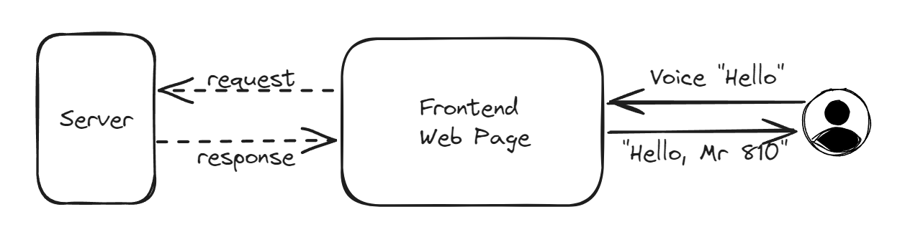
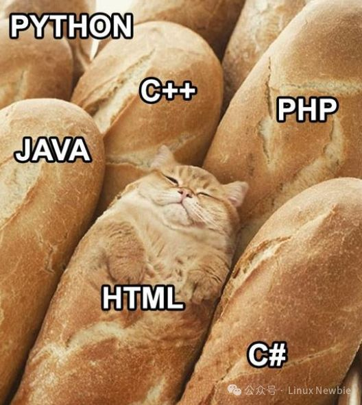
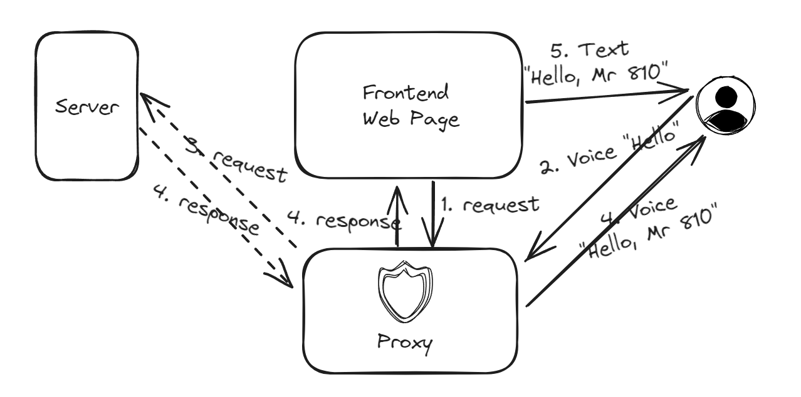

> All problems in computer science can be solved by another level of indirection  
> 计算机科学领域的任何问题都可以通过增加一个中间层来解决。 —— Butler Lampson

## 需求

最近的项目中需要实现一个语音控制的功能，大致需求是这样的：

- 用户使用的设备有语音识别的功能（已实现 Python 接口），识别到唤醒词后能够输出
- 用户交互通过一个前端网页实现，网页部署在服务器上
- 用户语音说出唤醒词后需要访问后端接口并将结果显示在网页上，后端也部署在服务器上

简单来说，就是用户使用语音控制页面发出请求，但是语音识别接口在本地而不在服务器后端。



> 为什么有这种需要，问就是开发板没有接口 + 想本地部署语音识别导致的

## 分析

问题的关键是页面和用户之间怎么通过语音交互，最初的想法是识别到唤醒词输出后怎么通过 Python 让页面发出请求，在页面得到响应后再把响应交给 Python。也就是 Python 调用浏览器中的 JavaScript，和浏览器中的 JavaScript 调用本地 Python。

感觉用 Selenium 模拟操作浏览器网页可以实现，但感觉怪怪的，不够优雅（？



总之最后只是想想，没有具体考虑这种方案。

在第二天早上睡醒的时候，重新想了一下这个问题，突然想到一个新方案（**睡觉真的有用** (∂ω∂)

如果系统的控制权、代码完全被掌控，很容易添加中间层；

前端可以一直发送请求，本地用类似代理的方式，拦截前端的请求，发送到服务器得到响应返回给前端。  
因为中间的请求响应完全经过代理，代理可以实现更多具体逻辑，比如**等待语音唤醒出现后才放行请求**！  
从服务器拿到响应后也直接可以自己处理，而不是页面转交。

进一步的，前端其实不需要一直发送请求，只要在代理将前一个请求的响应交给自己之后再发送下一个也可以。  
而且前端的请求不需要发送给后端才被拦截，而是可以直接主动发给代理，由代理去请求响应

整理一下逻辑就是：
1. 前端初始向代理发出请求
2. 代理拦截请求，等待语音识别结果
3. 识别到唤醒词时，代理向服务器请求
4. 代理得到服务器响应，用响应做语音反馈，同时响应转交给前端
5. 前端得到响应进行展示，同时向代理发出下一个请求



我觉得这个方案挺好的，代理可以直接用 Python 实现。把整体功能解耦处理，前端主要做的还是请求响应，功能上和原来保持一致，同时把语音控制的具体逻辑处理放到代理方（嗯 很好


## 实现

写一下关键部分的 demo

### 中间层代理 Proxy

因为离线语音识别使用 Python 封装输出接口，代理的实现也选择了 Python，理论上功能不复杂，就选择用 Flask 直接实现了。

```python
from flask import Flask
from flask_cors import CORS 
from threading import Thread
import requests
import json

flag = False

app = Flask(__name__)
# 处理网页访问 localhost:5000 时的跨域问题
cors = CORS(app)
app.config['CORS_HEADERS'] = 'Content-Type'

@app.route('/')
def hello_world():
    global flag
    while True:
        if flag:
            res = requests.get("https://webaddr.com/api") # 发送体征查询
            flag = False
            return json.loads(res.text)['data']

# 模拟一个语音识别线程，随机时间设置 flag = True
def test_set_flag(sec):
    global flag
    import time
    import random
    while True: 
        time.sleep(random.randint(5, sec))
        flag = True

if __name__ == '__main__':
    t1 = Thread(target=test_set_flag, args=(10, ))
    t1.start()
    app.run(port=5000, debug=True)
```

### 前端请求

前端使用 vue 实现，直接访问 localhost:5000 即可，当代理没返回时页面会将请求先挂起，我们只要在请求响应转交到自己时才开始下一个请求。

```javascript
import axios from 'axios';

const delay = (n) => {
    return new Promise(function (resolve) {
        setTimeout(resolve, n * 1000);
    });
}

const getData = async () => {
    while (true) {
        let type;
        await axios.get("http://localhost:5000/").then(res => {
            console.log(res.data);
            isViewing.value = true
            signs.value = res.data['data'][0]
        }).finally(async function () {
            await delay(5);
            isViewing.value = false
        })
    }
}
getData()
```

最后效果还是不错的，收工

