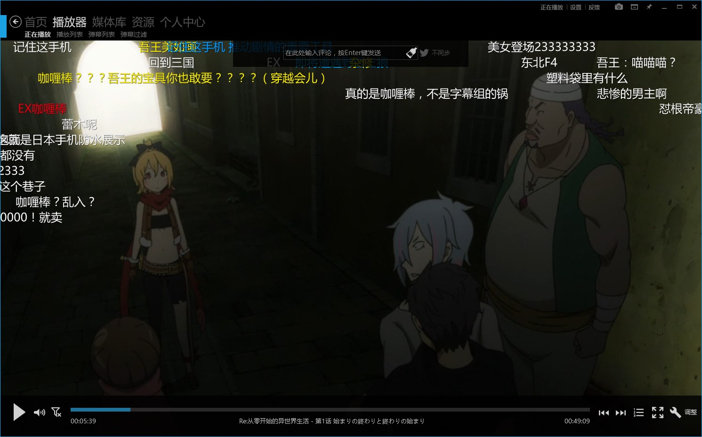
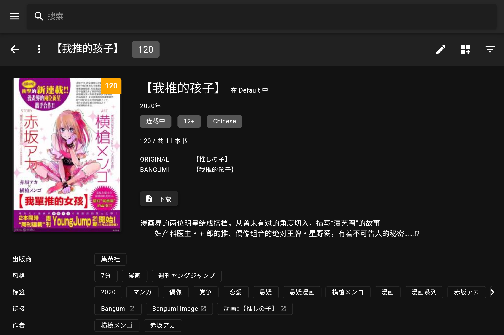
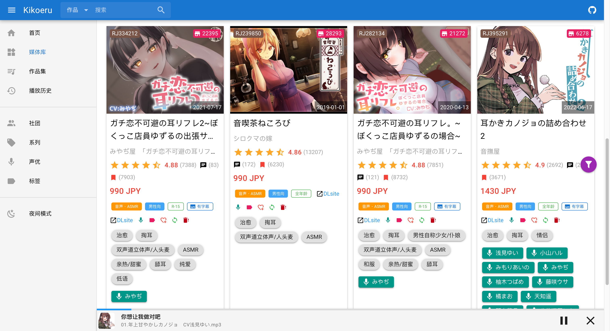
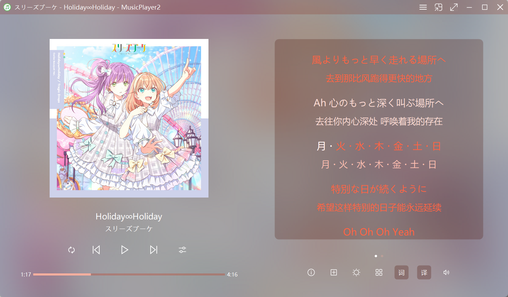

# 本地资源管理

想象一下，你有一个私人漫画库/影视媒体库/音乐库，
周五晚上的时候坐在客厅的小角落听最喜欢的乐队，
窝在懒人沙发里，
无聊了随手打开手边的设备，
远程连接到资源库，
成百上千的作品搭配上完整的元数据，
再整整齐齐地分门别类，
往那一摆，就像是艺术品，
然后点开看之前没空看的书和电影，
猫猫不经意地聚在人的周围……


## 零、前言

说起来我还是挺注意数据备份的（可能是因为以前曾经主机清灰的时候直接搞坏了叭），倒是也研究过网盘，但是网盘这东西，便宜、大容量、速度快就是不能共存的三角。

更关键的是国内网盘基本逃不过审查机制，就拿百度网盘来说，他的审查类似计算文件 hash 值，对比后台违规文件的 hash，对上毙掉（我有个超正常的视频就这样没了）。有审查机制在这一摆，数据隐私自然无从说起。所以就算说普通数据：


说到底网盘只是防灾的第二备份，如果需要对自己的数据进行「冷备份」（存进去，不经常取出来的存储），花点钱买个移动硬盘省下来的精力和时间绝对超过付出的金钱。硬盘做本地备份不需要花精力去考虑上传最快多少MB、下载限不限速、限制上传多大的文件、需不要加密上传、账号安全等问题，唯一要注意的是轻拿轻放不物理损坏就可以了。

所以呢，在我有了「数据只有存在本地才真正能让人放心」的观点后，收藏的动作少了，更多的是关心怎么保存到本地（虽然收藏了我能不看，但它不能没有 <span style="display: inline-grid; margin:-32px 0 -32px 0;"></span>）。而且在现在的环境下，一些真正好的文章、视频、资源总遭到有心者的恶意举报（大概触及到某些人的利益了吧，你免费的教程就能教会他们谁还来买我的课程啊？）

另一方面，关于影视音作品。~~您可能是正版的受害者。~~ 这句话就版权来说是一个歪理，但在大陆ACG市场却成了一个不得不面对的事实：动画，漫画，音乐，哪怕开了会员，付费得到的依然是不完整/删改后的内容（这里我想点名某 B 开头的视频网站和某红色的音乐软件，你们的版权制度到底保护了什么啊


## 一、动画

动画是我最开始保存的资源形式了，下载方式是用 [qbittorrent](https://qbittorrent.com/) BT 磁链下载，  
古早、原始，但是好用，然后可以配上 RSS 订阅实现自动下载，  
资源从 [mikan](https://mikanime.tv/)、[Nyaa](https://nyaa.land/) 等地方找，如果又能力加入 PT 论坛的话就可能更方便了。

管理工具用的是：[<span style="display: inline-grid;"></span> 弹弹play](https://www.dandanplay.com/) - 全功能“本地视频+弹幕”播放器

最吸引人的是 视频智能识别 -> **自动关联网络弹幕**。可以在播放本地动画视频时匹配弹幕（这下没理由 B 站追番了）。其他像追番记录云同步、AI语音识别、AI字幕翻译、内置BT磁力链下载其实我倒没怎么用。

哦对还有一个功能，它支持「远程访问」功能，能让其他设备访问 PC 资源，实现床上看番自由 σ`∀´)σ




## 二、漫画

漫画管理工具是用 [<span style="display: inline-grid;"></span> Komga](https://github.com/gotson/komga) - Media server for comics/mangas/BDs/magazines/eBooks

::github{repo="gotson/komga"}

至于我本地的是什么漫画，可以直接看[元数据](#元数据)那里写的规范和样例文件名，懂的都懂（  
不方便展示截图，这里的部署效果拿 @Moraxyc 的截图顶一下：




### 部署运行

官方提供多种安装[运行方案](https://komga.org/docs/category/official-methods)，对我来说最简单的是**直接使用 jar 运行**

> Windows 下命令行运行的功能都可以连结 **Listary** 实现快速启动，有机会聊聊

Komga 是一个 Java 程序，可以直接在 Java 8+ 或 1.8+ 的环境中运行：在 [Github Releases](https://github.com/gotson/komga/releases) 下载 `.jar` 文件，使用以下命令运行

```shell
java -jar komga-1.10.4
```

默认的数据存放路径在 `%USERPROFILE%\.komga`

> 使用 `javaw` 替代 `java` 命令可以实现后台无终端运行  
> （这种方法大概只能通过杀死 Java 进程结束程序。。部署服务器上的话可能方便点，但是本机还是算了）

安装之后默认的端口是 25600，访问 localhost:25600 提示创建用户（Translation 可以修改语言）

然后根据提示添加库就能使用拉。其他设备想要访问只要浏览器开 `ip:25600` 就可以了，或者 Tachiyomi（目前被版权制裁了）/ Mihon（Tachi 的精神继承者）里也有 Komga 的插件可以试试。

本地库目录的文件结构大概这样

```
comic
├── 漫画1
|   ├── 第一话.cbz
|   └── 第二话.cbz
└── 漫画二
    ├── 第一话.cbz
    └── 第二话.cbz
```

这里的 cbz（comic book zip） 其实就是 zip 的后缀名直接改成 cbz，对应的 rar 改成 cbr 也可以。

Komga 支持 CBZ/CBR、EPUB、PDF 格式。对于漫画而言，个人觉得 cbz 是最简单、兼容性最高的格式。如果漫画文件中存在 `ComicInfo.xml` 元数据文件，那么会被 Komga 直接识别，就无需手动补齐元数据了。

### 元数据

Komga 啥都好，唯一的问题就是不支持在线元数据刮削，只能从 commicinfo.xml 查找元数据

手动设置内嵌数据可以试试 **ComicTagger** ，其他刮削方案有 calibre + ehentai，[BangumiKomga](https://github.com/chu-shen/BangumiKomga)

不过在我之前当仓鼠囤积漫画时，曾经对本地漫画进行了统一命名规范管理，所以在转移到 Komga 时是用自己写的脚本实现基本元数据添加的

统一命名如下：

- (展会/杂志/Web) [社团 (作者)] 日文标题 (原作) [tag1] [tag2] [tag3]...

通常第一个 tag是语言：[韓国翻訳] [中国翻訳] [英訳] [ロシア翻訳] [スペイン翻訳]  
其他 tag 有 [汉化组的名字] [DL版] [カラー化] [無修正] 等  
原作标签：作品不是二创 (オリジナル) 原创，或者原作是多部作品 (よろず) 杂本

以下是几个示例文件名：

- (C71) [偽MIDI泥の会 (石恵)] TSUKAIMAkuri (ゼロの使い魔) [中国翻訳] [無修正]
- (COMIC1☆12) [OrangeMaru (YD)] 自動攻略 (FateGrand Order) [ロシア翻訳] [Ancol]
- (エアコミケ3) [きょくちょ局 (きょくちょ)] メイド教育。 - 没落貴族瑠璃川椿- (オリジナル) [中国翻訳] [無修正]


<details>
  <summary>元数据脚本，设置路径后会递归搜索子目录下的 cbz 文件，嵌入 ComicInfo.xml 信息</summary>

```python
from pathlib import Path
import shutil
import re
import zipfile

errorFile = []

def parse_filename(file_path):
    '''使用正则表达式解析文件名'''
    pattern = r"\(([^)]+)\) \[([^\]]+)\] (.*)"
    match = re.match(pattern, file_path.stem)
    # 分组提取信息
    expo, circle, title_original_tags = match.groups()
    metadata =  {
        "event": expo,
        "author": circle,
        "tags": [],
        "original": "オリジナル",
        "title": file_path.stem,
        "filename": file_path.stem
    }
    
    pattern = r'\[(.*?)\]'
    match = re.findall(pattern, title_original_tags)
    metadata["tags"] = match if match else []
    metadata["tags"].append(expo)
    
    for tag in metadata['tags']:
        title_original_tags = title_original_tags.replace(f"[{tag}]", "")
    title_original = title_original_tags.strip()
    
    pattern = r'\((.*)\)$'
    match = re.findall(pattern, title_original)
    metadata['original'] = match[0] if match and match[0] else 'オリジナル'
    metadata['title'] = title_original.replace(f"({metadata['original']})", "").strip()
    metadata['filename'] = file_path.stem
    return metadata


def generateComicInfo(metadata):
    '''生成ComicInfo.xml内容'''
    template = \
"""<?xml version='1.0' encoding='utf-8'?>
<ComicInfo xmlns:xsi="http://www.w3.org/2001/XMLSchema-instance" xmlns:xsd="http://www.w3.org/2001/XMLSchema">
  <Title>{title}</Title>
  <Series>{filename}</Series>
  <AlternateSeries>{original}</AlternateSeries>
  <Publisher>{event}</Publisher>
  <Writer>{author}</Writer>
  <Tags>{tags}</Tags>
</ComicInfo>
"""
    return template.format(filename=metadata['filename'], 
                title=metadata['title'], 
                original=metadata['original'],
                event=metadata['event'],
                author=metadata['author'],
                tags=','.join(metadata['tags']))


def add_metadata_to_cbz(cbz_path:Path):
    '''添加comicInfo'''
    global errorFile
    print(cbz_path)
    
    def support_gbk(zip_file: zipfile.ZipFile):
        '''python ziplib 无法正常解包 gbk 编码'''
        name_to_info = zip_file.NameToInfo
        for name, info in name_to_info.copy().items():
            try:
                real_name = name.encode('cp437').decode('gbk')
            except:
                real_name = name.encode('utf-8').decode('utf-8')
            if real_name != name:
                info.filename = real_name
                del name_to_info[name]
                name_to_info[real_name] = info
        return zip_file
    
    # 解压CBZ文件到临时目录
    temp_dir = Path('temp_extracted')
    with support_gbk(zipfile.ZipFile(cbz_path, 'r')) as zip_ref:
        zip_ref.extractall(temp_dir)

    # 创建comicInfo.xml
    comic_metadata = parse_filename(cbz_path)
    comic_info = generateComicInfo(comic_metadata)
    try:
        temp_dir = Path('temp_extracted') / cbz_path.stem
        with open(temp_dir / 'ComicInfo.xml', 'w+', encoding='utf-8') as f:
            f.write(comic_info)
    except Exception as e:
        temp_dir = Path('temp_extracted')
        with open(temp_dir / 'ComicInfo.xml', 'w+', encoding='utf-8') as f:
            f.write(comic_info)
    # 重新打包为CBZ
    with zipfile.ZipFile(cbz_path, 'w') as zip_ref:
        for file_path in (temp_dir).rglob('*'):
            if file_path.is_file():  # 确保只添加文件
                relative_path = file_path.relative_to(temp_dir)
                zip_ref.write(file_path, relative_path)
    # 清理临时文件和文件夹
    shutil.rmtree(Path('temp_extracted'))


def scan_cbz_files(directory):
    path = Path(directory)
    # 遍历目录
    for file in path.rglob('*.cbz'):  # rglob方法用于递归搜索所有匹配的文件
        add_metadata_to_cbz(file)


directory = 'F:\漫画' # 根据需要更改
scan_cbz_files(directory)
```

:::note[TODO]
后续可能会进一步联网获取 tags 信息
:::

</details>

## 三、音声

[<span style="display: inline-grid;"></span> Kikoeru](https://github.com/vscodev/kikoeru) - Self-hosted web media player for DLsite works 

::github{repo="vscodev/kikoeru"}

Kikoeru 是一款使用Go开发的跨平台同人音声媒体整理和播放软件。

- 自动从DLsite爬取音声元数据，支持所有作品类型（RJ/BJ/VJ），包括已下架的作品。
- 强大的个性化搜索功能，支持多关键字、多标签检索，支持对搜索结果二级筛选过滤。
- 支持多种格式的字幕显示，`.lrc` 、`.srt` 、`.vtt` 以及 `.ass`，支持字幕偏移。

因为 原版的 Kikoeru 好像年久失修 8位RJ号无法导入（那个时候我还开始听音声所以不具体太清楚）



### 运行

找了一个基于 Go 重写的版本，使用方法简约甚至有些过于简单：

现在同级目录创建一个 media 文件夹，把解压的音声文件夹放进去

- 更新元数据（因为从 DSLite 上获取，所以得开一下代理）

```shell
kikoeru.exe sync -x socks5://127.0.0.1:7890
```

元数据是根据自带 RJ 号从 DSLite 上获取的（有统一标识就是爽啊）

- 启动程序

```shell
kikoeru.exe start
```

然后访问 http://localhost:2333 即可

### 翻译

<big>最有效的方案：学日语！</big>

> 我在南+找到一个 [whisper-finetune-500h](https://www.south-plus.net/read.php?tid-1919446.html)，用 500h 音声数据专炼的 whisper 模型，有兴趣可以试试  
> 除了特定数据上微调对ASMR特有的词汇准确，而且实现日语音声直接转录成中文文本，免去翻译这一步！


## 四、音乐

播放器：[MusicPlayer2](https://github.com/zhongyang219/MusicPlayer2) - 集音乐播放、歌词显示、格式转换等众多功能于一身的音频播放软件

::github{repo="zhongyang219/MusicPlayer2"}

音乐直接上电报搜索下载  <span style="display: inline-grid; margin: -32px 0 -32px 10px"></span>

:::tip
win11 上主界面标题上面会有一条白边，可以在兼容性设置 Win8 临时隐藏起来  
（[主界面顶部白条可以隐藏吗 · Issue #518 · zhongyang219/MusicPlayer2](https://github.com/zhongyang219/MusicPlayer2/issues/518)）
:::

软件支持一定程度的自定义界面：[用户自定义界面](https://github.com/zhongyang219/MusicPlayer2/wiki/用户自定义界面)



<details>
    <summary>自定义界面代码</summary>

原版皮肤作者：[基于ui11写了个皮肤 · Issue #665 · zhongyang219/MusicPlayer2](https://github.com/zhongyang219/MusicPlayer2/issues/665)，我加了歌词和译文的按钮

```xml
<root xmlns="https://github.com/zhongyang219/MusicPlayer2/skin" xmlns:xsi="http://www.w3.org/2001/XMLSchema-instance" xsi:schemaLocation="https://github.com/zhongyang219/MusicPlayer2/skin ./skin.xsd"
      index="12">
  <ui type="big">
    <horizontalLayout margin="24">
      <verticalLayout>
        <verticalLayout>
          <albumCover square="true" margin  ="24"/>
          <verticalLayout height="50">
            <text type="title" font_size="12" alignment="center"/>
            <text type="artist" font_size="10" alignment="center"/>
          </verticalLayout>
        </verticalLayout>
        <horizontalLayout height="56">
          <button key="repeatMode" width="32" height="32" margin="4"/>
          <button key="previous" width="48" height="48" margin="4" bigIcon="true"/>
          <button key="playPause" width="48" height="48" margin="4" bigIcon="true"/>
          <button key="next" width="48" height="48" margin="4" bigIcon="true"/>
          <button key="equalizer" width="48" height="48" margin="4" bigIcon="true"/>
        </horizontalLayout>
        <progressBar height="40" show_play_time="true" play_time_both_side="true" margin-left="16" margin-right="16"/>
      </verticalLayout>
      <verticalLayout margin-left="32">
        <stackElement ckick_to_switch="false" show_indicator="true" margin-bottom="16">
          <verticalLayout>
            <lyrics margin="24"/>
          </verticalLayout>
          <verticalLayout margin-top="20" margin-bottom="8" margin-left="8" proportion="6">
            <playlistIndicator height="30" margin-bottom="4"/>
            <playlist item_height="32"/>
          </verticalLayout>
        </stackElement>
        <horizontalLayout height="48">
          <button key="info" width="28" height="28" margin-left="8" margin-right="8"/>
          <button key="addToPlaylist" width="28" height="28" margin-left="8" margin-right="8"/>
          <button key="darkLightMode" width="28" height="28" margin-left="8" margin-right="8"/>
          <button key="mediaLib" width="28" height="28" margin-left="8" margin-right="8"/>
          <button key="desktopLyric" width="28" height="28" margin-left="8" margin-right="8"/>
          <button key="lyricTranslate" width="28" height="28" margin-left="8" margin-right="8"/>
          <volume show_text="false" width="28" height="28" margin-left="8" margin-right="8"/>
        </horizontalLayout>
      </verticalLayout>
    </horizontalLayout>
  </ui>
  
  <ui type="narrow">
    <verticalLayout margin="20">
      <stackElement ckick_to_switch="false" show_indicator="true" margin-bottom="14">
        <verticalLayout>
          <text type="title" font_size="12" style="scroll" height="32" alignment="center"/>
          <text type="artist" font_size="10" style="scroll" height="32" alignment="center"/>
          <albumCover square="true" margin="24"/>
        </verticalLayout>
        <verticalLayout>
          <placeHolder proportion="1"/>
          <horizontalLayout height="96">
            <albumCover square="true" width="96"/>
            <verticalLayout margin-left="16">
              <text type="title" font_size="12" style="scroll" height="32"/>
              <text type="artist" font_size="10" style="scroll" height="32"/>
              <text type="album" font_size="10" style="scroll" height="32"/>
            </verticalLayout>
          </horizontalLayout>
          <placeHolder max-height="24" proportion="2"/>
          <spectrum max-height="80" fixed_width="true" draw_reflex="true" proportion="10"/>
        </verticalLayout>
        <verticalLayout>
          <horizontalLayout height="64" hide-height="200">
            <verticalLayout margin-left="16">
              <text type="title" font_size="12" style="scroll" height="32" alignment="center"/>
              <text type="artist" font_size="10" style="scroll" height="32" alignment="center"/>
            </verticalLayout>
          </horizontalLayout>
          <lyrics margin="8"/>
        </verticalLayout>
      </stackElement>
      <horizontalLayout height="56" margin-top="8">
        <button key="repeatMode" width="32" height="32" margin="4"/>
        <button key="previous" width="48" height="48" margin="4" bigIcon="true"/>
        <button key="playPause" width="48" height="48" margin="4" bigIcon="true"/>
        <button key="next" width="48" height="48" margin="4" bigIcon="true"/>
        <button key="showPlaylist" width="32" height="32" margin="4"/>
      </horizontalLayout>
      <progressBar height="40" show_play_time="true" play_time_both_side="true" margin-left="16" margin-right="16"/>
    </verticalLayout>
  </ui>
  
  <ui type="small">
    <verticalLayout margin="8">
      <stackElement ckick_to_switch="false" show_indicator="true" margin="8" margin-bottom="14">
        <horizontalLayout>
          <albumCover square="true" width="100"/>
          <verticalLayout margin-left="16">
            <text type="title" font_size="12" style="scroll" height="32"/>
            <text type="artist" font_size="10" style="scroll" height="32"/>
            <text type="album" font_size="10" style="scroll" height="32" hide-height="96"/>
          </verticalLayout>
        </horizontalLayout>
        <verticalLayout margin-left="8" margin-right="8">
          <text type="title" font_size="12" style="scroll" height="24"/>
          <text type="artist" font_size="10" style="scroll" height="20"/>
          <spectrum fixed_width="true" draw_reflex="true" margin-top="4" />
        </verticalLayout>
        <lyrics/>
      </stackElement>
      <horizontalLayout height="56">
        <button key="repeatMode" width="32" height="32" margin="4"/>
        <button key="previous" width="48" height="48" margin="4" bigIcon="true"/>
        <button key="playPause" width="48" height="48" margin="4" bigIcon="true"/>
        <button key="next" width="48" height="48" margin="4" bigIcon="true"/>
        <button key="showPlaylist" width="32" height="32" margin="4"/>
      </horizontalLayout>
      <progressBar height="22" show_play_time="true" play_time_both_side="true" margin-left="16" margin-right="16"/>
    </verticalLayout>
  </ui>
</root>
```

</details>


## 五、小说

TO BE CONTINUE...