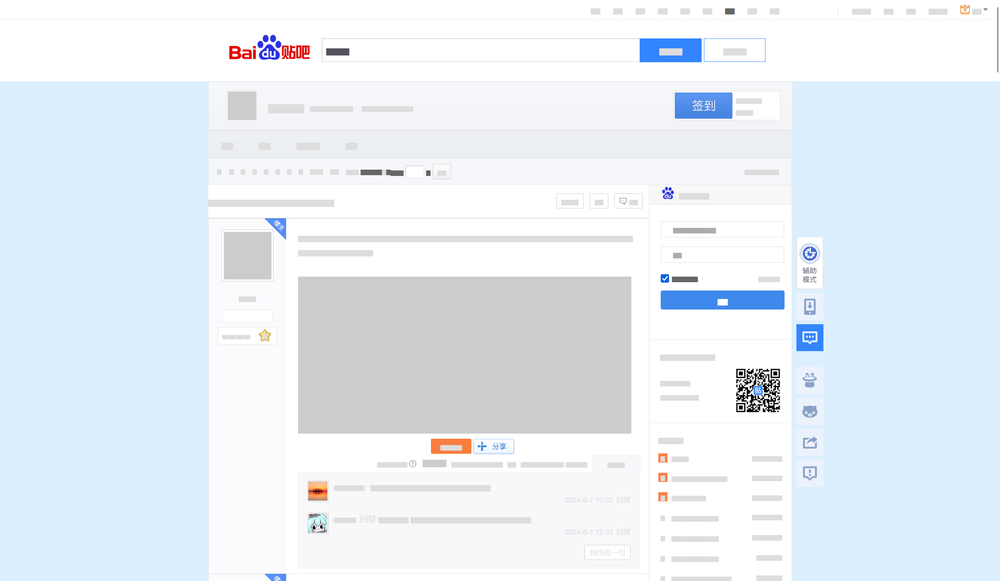
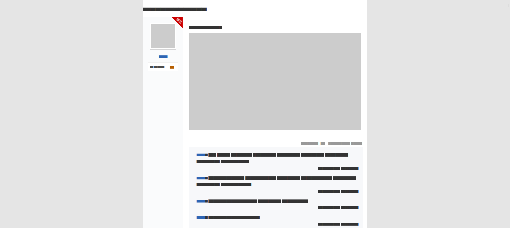

朋友说想保存贴吧的帖子，但是找不到能用的爬虫工具。我也没想到百度贴吧这种体量的站点，竟然找不到好用的单个帖子爬虫，看来只能自己动手了

## 数据获取

因为翻了一下，发现网页端贴吧的数据似乎是直接用 html 传的，所以获取数据的方案就是 requests 拿到 html + BeautifulSoup 解析文档信息。数据接口如下：

```
帖子：
https://tieba.baidu.com/p/{tid}?pn={pn}
看哪些楼有楼中楼回复：
https://tieba.baidu.com/p/totalComment?tid={tid}&pn={pn}&see_lz=0
看某楼的全部楼中楼：
https://tieba.baidu.com/p/comment?tid={tid}&pid={pid}&pn={pn}
```

这部分很无聊，全是体力活。用 [常用代码片段](../python-crawler-code-snippets/) 的知识就足够拿到所有想要的信息了

> 24/6/7 改用 [aiotieba](https://github.com/Starry-OvO/aiotieba) 的接口实现了，这个接口很方便就能得到数据，而且没有安全验证问题
> 
> 似乎安全验证问题仅限于网页端，移动端没有这个问题（但是我还不会爬移动端接口，有空研究一下好了


## 样式还原

这里记录一下之后的思路。

因为这次保存主要目的是留档纪念，与之前爬 Bilibili 动态评论不太一样，那次是为了数据分析。既然是留档，那最好就是彼时看到的和此时完全一样，也就是保留百度图片贴吧的页面样式。

因此我准备使用 HTML 作为最后的输出格式，做法很简单，随便打开一个帖子用 SingleFile 插件保存成 HTML。直接右键另存为倒也可以，不过贴吧现在有好多没有用的信息，这些一起保存下来完全没有必要，用插件的一个好处就是很方便的先对页面元素裁剪，然后再保存。

保存好之后，清理掉没用的 CSS 样式，保留一层楼以及楼中楼的 HTML 结构，这样就拿到了 HTML 模板，用上一节获取到的数据照着模板进行填充，最后保存成文件。结束

最后的样式前后对比（做了内容保护）





## GUI

为了方便别人用，我还搞了个小 UI，用的 [PyStand](https://github.com/skywind3000/PyStand)（这个打包真的方便且精简，以后再也不折腾 PyInstaller 和 Nuitka 了~）

最后的最后：[项目地址](https://github.com/U1805/TiebaSpider)

::github{repo="U1805/TiebaSpider"}